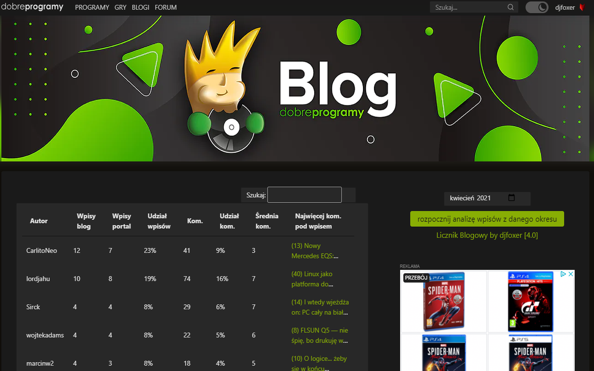
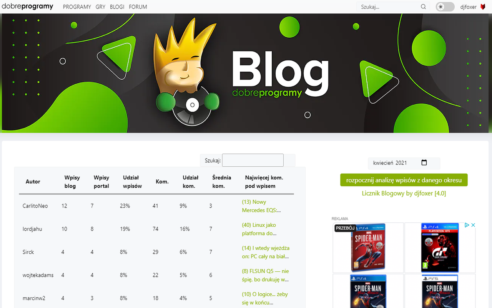
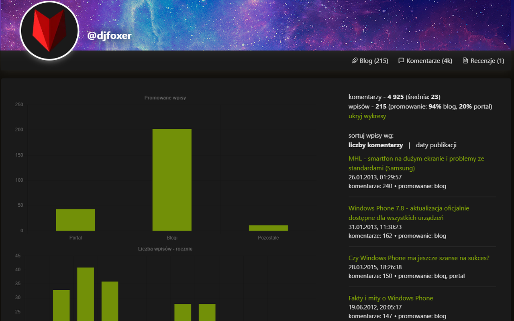
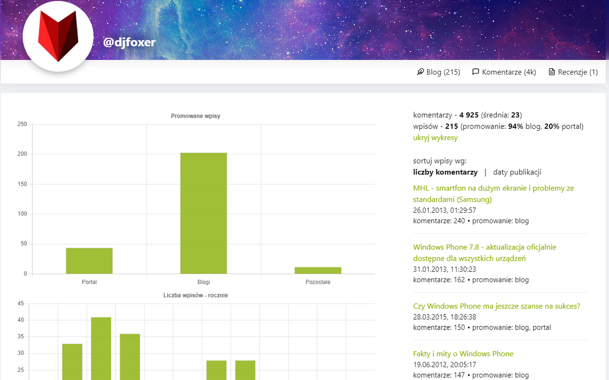

#  Licznik Blogowy 

Licznik Blogowy przeznaczony jest do analizy blogów na portalu [https://www.dobreprogramy.pl/](https://www.dobreprogramy.pl/). Wtyczka pozwoli na bardzo szczegółową analizę statystyk każdego bloga. Dodatek na żądanie pobierze wszystkie wpisy aktualnie wyświetlanego bloga i przedstawi wykresy oraz tekstowe statystyki związane z prowadzonym blogiem. Licznik Blogowy zbiera dane odnośnie ilości wpisów oraz komentarzy.

Licznik Blogowy dodaje przycisk na stronie domowej autora bloga portalu [https://www.dobreprogramy.pl/](https://www.dobreprogramy.pl/). Wtyczka działa dla każdego bloga, nie trzeba być zalogowanym. Jeśli jednak jesteś zalogowany, wówczas Licznik Blogowy przedstawi jeszcze więcej statystyk po wejściu na Twojego bloga.

Wtyczka dynamicznie zbiera statystyki z bloga na żądanie użytkownika. Po zakończeniu obliczeń z prawej strony wyświetlone zostaną wszystkie wpisy użytkownika. Posiadają one pełny tytuł, datę oraz ilość komentarzy. Po kliknięciu na tytuł przejdziemy do wpisu. Na samej górze pokazane są podstawowe statystyki odnośnie bloga. 

Stworzoną przez aplikację listę można posortować względem:
- ilości komentarzy
- daty publikacji

Klikając na przycisk pokaż wykresy uruchomimy opcję do generowania wykresów. Tutaj otrzymamy szczegółowe wykresy bazujące na danych zebranych z bloga:
- ilość wpisów promowanych na portalu/blogu/pozostałe
- ilość wpisów - rocznie
- ilość wpisów - miesięcznie
- ilość wpisów - dzień tygodnia
- ilość wpisów - godzinowo
- średnia ilość komentarzy na wpis rocznie
- ilość komentarzy - rocznie
- ilość komentarzy - miesięcznie
- ilość komentarzy - dzień tygodnia
- top 10 komentujących wg "łapek w górę"
- top 10 komentujących wg "łapek w dół"
- top 10 komentujących wg ilości komentarzy
- ilość komentarzy - godzinowo

Będąc na własnym blogu można także wykonać backup wszystkich wpisów blogowych. Po kliknięciu na przycisk w tle zostanie przeprowadzona archiwizacja, która stworzy finalnie plik "zip" z wpisami blogowymi i zdjęciami. Prędkość stworzenia archiwum zależy od prędkości łącza i ilość zdjęć w postach. Może to potrwać kilka dobrych minut.

Dodatkowo na głównej stronie bloga jest możliwość analizy globalnych blogów w wybranym okresie miesięcznym. Wynikiem analizy jest tabelka, która posiada zagregowanie wpisy autorów blogów w danym miesiącu. Pozwala to na szybkie zapoznanie się z ilością wpisów i komentarzy, ze szczegółową rozpiską każdego z parametrów w skali globalnej (miesięcznej).

Wtyczka integruje się całkowicie ze stroną. Menu do sortowania wpisów, a także przyciski i pola tekstowe wykorzystują styl bloga. Wtyczka wspiera jasny i ciemny motyw portalu. Pozwala to na jeszcze lepsze wpasowanie się wtyczki w stylistykę i założenia bloga.

W wersji 4.0 wprowadza integrację z nową odsłoną portalu.

### Strona z opisem wersji 5.0: [Licznik Blogowy 5.0](https://www.djfoxer.pl/licznik_blogowy_redirect.html)

